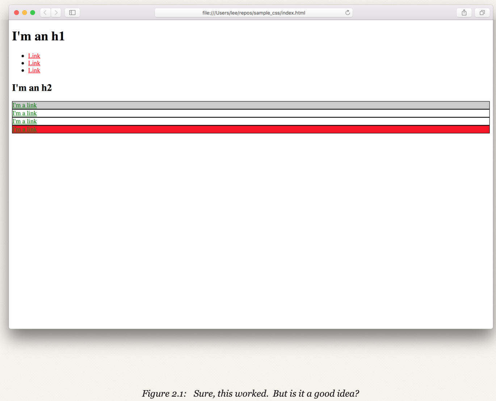

Creating github pages:

```bash
$ cd css_course         # cd to the home directory
$ mkdir -p repos/<username>.github.io  # Make site directory
$ cd repos/<username>.github.io        # cd into new directory
$ touch index.html 
```

Cascades visualization

source: https://www.learnenough.com/course/css_and_layout/introduction/start_stylin


source: https://www.learnenough.com/course/css_and_layout/introduction/start_stylin

Using `classes` and `ids`:
```html
<!DOCTYPE html>
<html>
  <head>
    <title>Test Page: Don't Panic</title>
    <meta charset="utf-8">
    <style>
      a {
        color: red;
      }
      #exec-bio {
        background-color: lightgray;
      }
      .bio-box {
        border: 1px solid black;
      }
      .bio-box a {
        color: green;
      }
      .red {
      background: red;
      }
    </style>
  </head>
  <body>
    .
    .
    .
    <h2>I'm an h2</h2>
    <div id="exec-bio" class="bio-box">
      <a href="https://example.com/">I'm a link</a>
    </div>
    <div class="bio-box">
      <a href="https://example.com/">I'm a link</a>
    </div>
    <div class="bio-box">
      <a href="https://example.com/">I'm a link</a>
    </div>
    <div class="bio-box red">
      <a href="https://example.com/">I'm a link</a>
    </div>
  </body>
</html>
```

Classes and ids:

source: https://www.learnenough.com/course/css_and_layout/introduction/basics_selectors

One of the other decisions we have to make is to decide when we should use ids and when we should use classes. As noted in Section 1.5, ids are intended to target only one element on the page, while classes can target multiple things. To enforce this design, HTML elements will accept multiple class names on a single object (separated by spaces), but allow for only one id per element (anything after the first is ignored). But that isn’t the whole story, because browsers treat ids and classes differently, and here is the first place where we’re going to run the risk of starting a holy war…

**Our view is as follows:**

You should strive to use ids only when you absolutely have to (for example, if you are using JavaScript, and then use them only for JavaScript).

Overcoming the strength of an id style by combining the id and a class.
```html
<!DOCTYPE html>
<html>
  <head>
    <title>Test Page: Don't Panic</title>
    <meta charset="utf-8">
    <style>
      a {
        color: red;
      }
      #exec-bio {
        background-color: lightgray;
      }
      .bio-box {
        border: 1px solid black;
      }
      .bio-box a {
        color: green;
      }
      .alert {
      background: red;
      }
      #exec-bio.alert {
      background: red;
      }
    </style>
  </head>
  <body>
    .
    .
    .
    <h2>I'm an h2</h2>
    <div id="exec-bio" class="bio-box alert">
      <a href="https://example.com/">I'm a link</a>
    </div>
    <div class="bio-box">
      <a href="https://example.com/">I'm a link</a>
    </div>
    <div class="bio-box">
      <a href="https://example.com/">I'm a link</a>
    </div>
    <div class="bio-box red">
      <a href="https://example.com/">I'm a link</a>
    </div>
  </body>
</html>
```

Result:

source: https://www.learnenough.com/course/css_and_layout/style-of-style/css_why

Priority:

source: https://www.learnenough.com/course/css_and_layout/style-of-style/specificity

Specificity:

source: https://www.learnenough.com/course/css_and_layout/style-of-style/specificity

**Never use !important**
There’s another bad way of getting a style to apply, and that is to use the !important flag to the declaration, which automatically overrides any conflicting styles (Table 2.1). You should think about !important (read “important”; the “!” is silent) like this: if you’ve had to use !important, then you’ve failed at styling something.

The problem with using !important is that once you start using it, there’s a tendency to use it more and more over time, since the only way to overcome a style that was applied with !important is to use another !important. Such proliferating !important rules are the tribbles of CSS.

**Colors**
In addition to using RGB hex, you can also use RGB directly using rgb(), which allows you to use decimal numbers in place of hex. In other words, rgb(255, 255, 255) is the same as #ffffff, etc. But the main reason to use RGB directly is to set transparency via the rgba() command.

In rgba(), the a stands for alpha, because the conventional name for transparency level in image processing is the alpha level. The alpha level is indicated using a number between 0 and 1, where 0 is transparent, 1 is opaque, and decimals in between define all the levels of partial transparency (50% is 0.5, 25% is 0.25, etc.).

For example, let’s make the social link’s background a transparent gray using rgba(). We’ll select a fairly dark gray, corresponding to RGB values of 150 each (out of 255), and initially set an opacity of 1 (Listing 3.3).

```html
/* GLOBAL STYLES */
a {
  color: #f00;
}
.social-link {
  background: rgba(150, 150, 150, 1);
  color: blue;
}
```

**Sizing**
```html
h2 {
  font-size: 30px;
}

/* BIO STYLES */
.
.
.
.bio-wrapper {
  width: 500px;
}
.bio-box {
  border: 1px solid black;
  width: 50%;
}
```
 
Why it looks like that, because `bio-box` class has 50% of `bio-wrapper` width.
